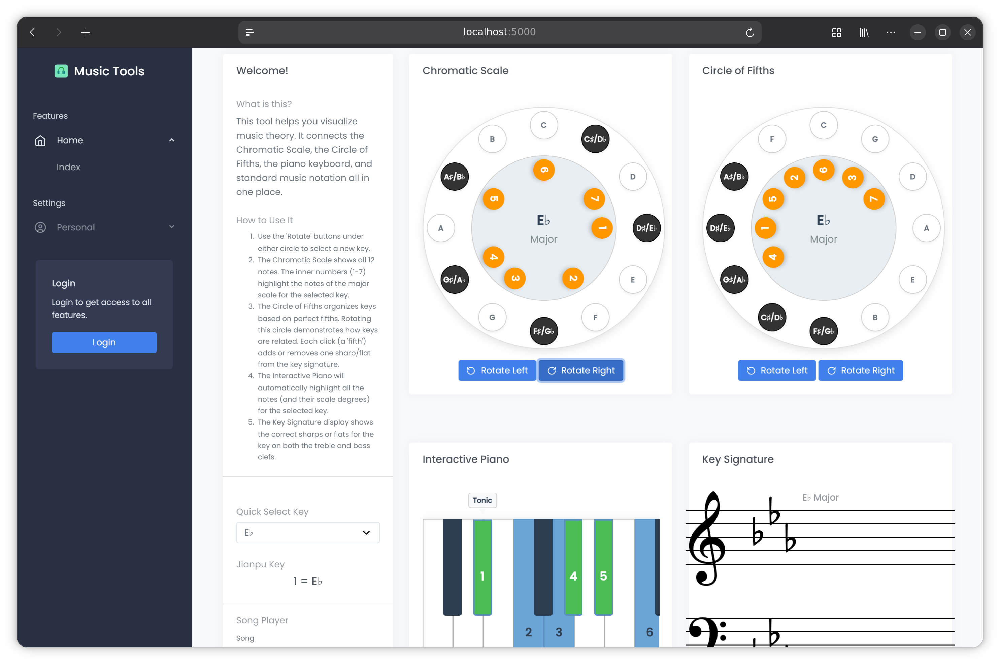

# MusicTools

[](https://github.com/aiursoftweb/musicTools/blob/master/LICENSE)
[](https://gitlab.aiursoft.com/aiursoft/musicTools/-/pipelines)
[](https://gitlab.aiursoft.com/aiursoft/musicTools/-/pipelines)
[](https://github.com/aiursoftweb/musicTools/-/commits/master?ref_type=heads)
[](https://musicTools.aiursoft.com)
[](https://hub.docker.com/r/aiursoft/musictools)

MusicTools is a project built with ASP.NET Core that provides various music-related tools and features.



Default user name is `admin@default.com` and default password is `Admin@123456!`.

## Try

Try a running MusicTools [here](https://musictools.aiursoft.com).

## Focused listening practice

MusicTools separates the listening context from the notation being tested. Students
compare **one measure and one declared edit location**, not six long scores looking
for scattered mistakes. The existing **Manage Questions** permission, Template
authentication, StorageService and Canon queue are reused.

1. Upload MusicXML (`.musicxml`, `.xml` or compressed `.mxl`, up to 20 MB).
   MuseScore projects open an export guide instead of requiring a native converter.
2. Select the context range (1–32 consecutive measure positions), part and staff.
   Select one target measure inside it and a pitched-note position within that measure.
   Positions include pickups and can differ from the printed measure numbers.
3. Choose **pitch** (one note changes) or **rhythm** (that note and the immediately
   following pitched note change duration). All versions use the **same location**.
   Mixed edits are deliberately unavailable in this workflow.
4. Generate three versions, or four for pitch. Nearby key-signature notes are only
   starting suggestions, not a musical-quality guarantee. Rhythm offers equal,
   long–short and short–long patterns while keeping pitch and the pair's total duration.
   Unsupported locations/resolutions fail clearly; the system does not scatter edits
   elsewhere to fill a quota.
5. Review and audition **every version in context**. Edit the target pitch or rhythm
   directly, or request another pitch suggestion. Reject musical oddities and visual
   giveaways. Shared guidance must describe a listening cue, not a fixed correct note.
6. Publish after confirming every version is plausible, audibly distinct and suitable
   to be the answer. Snapshots are frozen; withdraw before further edits.
7. Anonymous practice randomly picks **which approved version to play**, independently
   of option ordering. The source version has no privileged correct status. Students
   see only the target measure, get an explicit task/location and can replay either
   the context or just the marked target interval. First submission counts.

Reviewed assets include the immutable context, short notation versions and each
version's context playback data. The answer and selected-version details are returned
only after submission. Withdrawing/revising a question invalidates its active attempts.
Legacy long-passage questions remain in the admin library and are excluded from focused
practice; recreate them rather than silently changing their reviewed content.

### MusicXML import and browser playback

Upload MusicXML (`.musicxml`, `.xml`, or compressed `.mxl`). MuseScore project
files (`.mscz` and `.mscx`) are not accepted: the upload page links to an illustrated
step-by-step export guide (File → Export → MusicXML). Do not rename extensions.

The server uses managed MusicXML parsing to prepare immutable timing data for each
reviewed option. Browsers render seekable audio using the locally shipped piano
samples already used by MusicTools. No MuseScore, Flatpak, display server, native
converter configuration or additional container packages are required. Playback
uses a uniform piano voice, not MuseScore's instrument plugins or expressive rendering.

### Operational and musical boundaries

- Back up the database **and** the configured storage directory, including Vault.
  Original scores, normalized files and reviewed question assets live in storage.
  Replaced/deleted assets are not automatically garbage-collected in this release;
  monitor disk usage and never delete files solely by their age.
- SQLite and MySQL have additive listening-review migrations. Existing scores
  remain accessible through their original storage location and can be reimported.
  Legacy long-passage questions remain in the management library, but are not
  offered in focused practice. Recreate their useful material through the focused
  review flow. Take a backup before upgrading a deployed database.
- Canon's queue is process-local. After a restart, use **Retry import** or **Retry
  audio** for interrupted work. No persistent distributed job queue is claimed.
- Anonymous attempts are bounded, in-memory and expire after 30 minutes. A restart
  loses attempts, not published questions. Multi-instance deployments require
  sticky sessions. This is a training tool, not a proctored examination platform.
- Passages inherit the preceding key, time signature and tempo and play once as
  written, without repeat/jump expansion. Include complete tied notes; a tie
  crossing a passage boundary is rejected. Score-partwise MusicXML is supported;
  export other representations through MuseScore first.
- Pitch candidates preserve rhythm; rhythm candidates preserve pitches and total
  duration. Grace notes, tied notes, chords and tuplets are not directly mutated.
  A passage with insufficient eligible material fails clearly instead of filling
  the question with duplicate options. Mixed edits are not offered in focused practice.
- A musician must audition every version and establish that each is plausible
  and audibly distinguishable: any version can be selected for playback. In particular,
  pickups need audible metric context; this release does not add an automatic
  count-in. Choose a passage with adequate context, or use another passage.
- Playback supports pitched piano notes, chords, rests, multiple voices, complete
  ties and tempo changes. Passages with grace notes, unpitched notes or microtones
  are rejected rather than silently played incorrectly. Sustain-pedal and other
  expressive markings are not synthesized; review the actual browser audio.
- Verify permission to use each source score. Private upload does not make a
  downloaded arrangement suitable for public distribution.

### Verification

Run the repository's Ninja, lint, build and tests. Build frontend assets before
the .NET build (not concurrently: Vite replaces the static-asset output directory):

```bash
ninja all --path .
npm --prefix src/Aiursoft.MusicTools/wwwroot ci
npm --prefix src/Aiursoft.MusicTools/wwwroot run build
bash ./lint.sh
dotnet build
dotnet test --collect:"XPlat Code Coverage" --logger "junit;MethodFormat=Class;FailureBodyFormat=Verbose"
```

For release acceptance, exercise MusicXML upload, MuseScore export guidance,
context/target selection, same-location musical editing, review and publication.
Verify three/four one-measure choices, target-only replay, changing played versions,
anonymous submission and withdrawal in a real browser. Check a narrow/mobile
viewport and dark mode.
These checks are not implied by a successful .NET unit-test run.

## Run in Ubuntu

The following script will install\update this app on your Ubuntu server. Supports Ubuntu 25.04.

On your Ubuntu server, run the following command:

```bash
curl -sL https://github.com/aiursoftweb/musicTools/raw/master/install.sh | sudo bash
```

Of course it is suggested that append a custom port number to the command:

```bash
curl -sL https://github.com/aiursoftweb/musicTools/raw/master/install.sh | sudo bash -s 8080
```

It will install the app as a systemd service, and start it automatically. Binary files will be located at `/opt/apps`. Service files will be located at `/etc/systemd/system`.

## Run manually

Requirements about how to run

1. Install [.NET 10 SDK](http://dot.net/) and [Node.js](https://nodejs.org/).
2. Execute `npm install` at `wwwroot` folder to install the dependencies.
3. Execute `dotnet run` to run the app.
4. Use your browser to view [http://localhost:5000](http://localhost:5000).

## Run in Microsoft Visual Studio

1. Open the `.sln` file in the project path.
2. Press `F5` to run the app.

## Run in Docker

First, install Docker [here](https://docs.docker.com/get-docker/).

Then run the following commands in a Linux shell:

```bash
image=aiursoft/musictools
appName=musictools
sudo docker pull $image
sudo docker run -d --name $appName --restart unless-stopped -p 5000:5000 -v /var/www/$appName:/data $image
```

That will start a web server at `http://localhost:5000` and you can test the app.

The docker image has the following context:

| Properties  | Value                           |
|-------------|---------------------------------|
| Image       | aiursoft/musictools               |
| Ports       | 5000                            |
| Binary path | /app                            |
| Data path   | /data                           |
| Config path | /data/appsettings.json          |

## How to contribute

There are many ways to contribute to the project: logging bugs, submitting pull requests, reporting issues, and creating suggestions.

Even if you with push rights on the repository, you should create a personal fork and create feature branches there when you need them. This keeps the main repository clean and your workflow cruft out of sight.

We're also interested in your feedback on the future of this project. You can submit a suggestion or feature request through the issue tracker. To make this process more effective, we're asking that these include more information to help define them more clearly.
